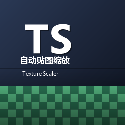

# 自动贴图缩放 (Texture Scaler)



一个 **客户端专用（client-side）Forge 1.20.1 Mod**，自动把过大的方块/物品贴图按显卡能力等比缩小，
从而修复 AMD 显卡 / Intel 核显上「中文变方块字 + 资源重载失败 + 崩溃」的问题。

> 英文名 *Texture Scaler* ｜ 需求说明见 [自动贴图缩放Mod-制作需求说明.md](自动贴图缩放Mod-制作需求说明.md)

## 原理（一句话）

启动时读取 `GL_MAX_TEXTURE_SIZE`（AMD RX580 / 多数核显为 16384，NVIDIA 为 32768），
用动态资源包把「会进入方块贴图集（block atlas）、最大边超过阈值」的贴图在加载时等比缩小，
atlas 就能塞进 GPU 上限，资源重载不再失败，字体（含中文字形）正常加载。

**不修改、不覆盖任何现有 Mod 的文件**（citymod / crab_city_facilities 等均不受影响），
只通过运行时资源覆盖生效。

## 缩放阈值

```
cap = clamp(GL_MAX_TEXTURE_SIZE / 32, 256, 2048)
```

| GPU | GL_MAX_TEXTURE_SIZE | cap |
|-----|--------------------|-----|
| NVIDIA RTX 系列 | 32768 | 1024（大图基本不缩） |
| AMD RX 580 / 多数 Intel UHD | 16384 | 512 |
| 老核显 | 8192 | 256 |

## 配置文件

位于 `.minecraft/config/texturescaler-client.toml`（Forge 客户端配置）：

- `enabled`：总开关，默认 `true`
- `capOverride`：手动覆盖阈值（像素），`0` = 自动（默认）
- `capDivisor` / `capMin` / `capMax`：自动阈值公式参数
- `diskCacheEnabled`：磁盘缓存，默认 `true`（缓存于 `.minecraft/texturescaler/cache/`）
- `cacheDir`：缓存目录
- `skipNamespaces`：不处理的命名空间，默认 `["minecraft", "texturescaler"]`
- `extraTextureDirs`：额外会进方块 atlas 的贴图目录（如 `["blocks"]`），默认空
- `debugLog`：调试日志，默认 `false`

## 实现要点

- `AddPackFindersEvent`（mod 总线）注册一个 `Position.TOP` + `required` 的动态资源包
  （id：`texturescaler_overlay`），优先级高于所有 mod 资源与玩家资源包。
- `getResource` 只处理 `assets/<ns>/textures/**/*.png` 且属于方块贴图集范围的贴图：
  先读 PNG 头快速跳过小图，超限的用 `NativeImage` 双线性等比缩小后返回覆盖。
- 原始贴图从「其它 pack 的快照」读取，失败时回退到实时资源管理器（带线程内重入保护，不会递归）。
- Blockbench 模型 UV 保护：扫描所有模型 JSON 的 `texture_size`，若模型按绝对像素 UV 引用贴图
  且 `texture_size` 大于新尺寸，则跳过该贴图（避免渲染错乱）。
- 缩放结果双缓存：内存（每次资源重载清空）+ 磁盘（key = 路径+原尺寸+cap 的哈希）。

## 构建

```bash
# 需要 JDK 17
gradlew build
# 产物：build/libs/texturescaler-1.0.2.jar
```

放入 `mods/` 即可，服务端不需要安装。

## 更新记录

- **v1.0.2**：启动提速。实测每次启动要跑两轮资源重载（另一 mod 触发），且每次都要全量扫描 3 万张贴图：
  - 新增磁盘尺寸清单（`cache/sizes.json`）：贴图路径 → 宽高的持久化清单，下次启动直接复用，
    不再对每张贴图重新打开文件读 PNG 头（原每次 ~1.9 万次文件 IO）；
  - 磁盘缓存命中不再解码原图：有尺寸（PNG 头）就能直接按缓存键取用缩放结果，原来即使缓存命中
    也会先解码整张大图再查缓存（每次启动白解码 157+ 张大图）；
  - Blockbench 模型 UV 约束检查提前到解码之前（语义不变）。
  更新 mod 后若遇异常，删除 `versions\<版本>\texturescaler\cache` 目录即可强制重建。
- **v1.0.1**：正式修复版（在 iGPU / GL_MAX_TEXTURE_SIZE=16384 的机器上实测通过，方块字消除）。
  在 v1.2.0 的 `listResources` 基础上补齐两处致命问题：
  - 图集拼接调用的是 `listResources("textures/block", ...)`（vanilla `atlases/blocks.json` 的
    directory 源 `source: "block"` 被 `FileToIdConverter` 拼成 `textures/block`），而 v1.2.0 只匹配
    `"textures"` 就提前返回，导致缩放结果（磁盘缓存已生成）**从未真正 emit 进图集列表**，图集仍拿到
    4096 原图、拼接依旧溢出。本版改为按前缀 `textures/` 匹配。
  - emit 时未按目录前缀过滤，曾把整个命名空间的全部缩放条目发给每个目录源（如把
    `textures/entity/...` 也发给 `textures/block` 源），`FileToIdConverter` 对不匹配前缀的路径做
    `substring` 时抛 `StringIndexOutOfBoundsException` 导致重载失败；现在 emit 前按
    `path + "/"` 前缀过滤，只输出该目录源名下的条目。
- **v1.2.0**：修复真正的根因——方块贴图集（atlas）是通过 `ResourceManager.listResources` 枚举
  `textures/block/` 等目录来获取贴图的，**并不走 `getResource`**；旧版只实现了 `getResource`，
  导致缩放过的大图永远进不了贴图集、拼接必然溢出。本版实现 `listResources`：每次重载惰性扫描一次
  完整贴图清单，把超限贴图等比缩小后以覆盖方式重新输出（overlay pack 优先级高于 mod 包，合并时覆盖原图），
  图集拼接即可成功、字体随之正常加载。
- **v1.1.0**：修复「命名空间发现依赖资源重载监听器时序」导致 overlay pack 实际不被查询的问题。
  命名空间改为多来源兜底（资源管理器 + 仓库）且永不缓存空结果；原图读取优先走实时资源管理器（带重入保护）；
  每次重载输出统计日志（查询/缩放/跳过/缺失/失败数量），便于排查。

## 作者

- **HoLuc1078**（开发）
- **Deepseek-v4-flash**（AI 辅助开发）

## 许可证

[Mozilla Public License 2.0](LICENSE)
