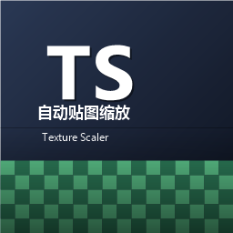

# 自动贴图缩放 (Texture Scaler)



客户端专用（client-side）多版本 Mod：首次资源重载时读取 `GL_MAX_TEXTURE_SIZE`，用动态资源包把**会进入方块图集**的超大贴图在加载时**等比缩小**，让图集塞进 GPU 上限，修复 AMD / Intel 核显上「图集溢出 → 资源重载失败 → 中文变方块字 / 崩溃」的问题。不修改、不覆盖任何现有 Mod 的文件。

英文名 *Texture Scaler* ｜ 多版本架构见 [MULTIVERSION.md](MULTIVERSION.md)。

## 支持的版本

| Minecraft | Forge | Fabric | NeoForge |
|-----------|:-----:|:------:|:--------:|
| 1.12.2 | ✅ | — | — |
| 1.16.5 | ✅ | ✅ | — |
| 1.18.2 | ✅ | ✅ | — |
| 1.19.2 | ✅ | ✅ | — |
| 1.20.1 | ✅ | ✅ | — |
| 1.21.1 | ✅ | ✅ | ✅ |
| 1.21.4+ | — | ✅ | ✅ |

1.12.2 无 Fabric（Fabric 自 1.14 起）；NeoForge 自 1.20.2 起存在。1.21.4 起只提供 Fabric / NeoForge。

## 缩放阈值

按贴图**用途**分档：

| 档位 | 命中条件 | NVIDIA 32768 | AMD/iGPU 16384 | 老核显 8192 |
|------|---------|--------------|----------------|-------------|
| 普通方块/物品贴图 | 最长边 ≤ `detailThreshold`（默认 1024） | 512 | **256** | 256 |
| 大显示贴图（图集、屏幕、站牌） | 最长边 > 1024 | 4096 | **2048** | 1024 |
| 长条贴图（长宽比 ≥ 4:1） | — | 8192 | **4096** | 2048 |

- 一律**等比**缩小：把最长边压到对应档位，另一条边按同一比例缩放。
- 动画条带（带 `.mcmeta`）只做**整数倍**缩放，且只在 `max(宽,高) > GL_MAX_TEXTURE_SIZE`（拼接器物理上放不下）时才缩，帧格与帧数保持不变；找不到合适的整数因子则整张不动。
- `.mcmeta` 里**显式写了** `width`/`height` 的贴图一律不动。

## 配置文件

- **Forge / NeoForge**：`.minecraft/config/texturescaler-client.toml`
- **Fabric**：`.minecraft/config/texturescaler.json`
- **Forge 1.12.2**：`.minecraft/config/texturescaler.cfg`

选项：`enabled`、`capOverride`、`capDivisor`、`capMin`、`capMax`、`diskCacheEnabled`、`cacheDir`、`skipNamespaces`、`extraTextureDirs`、`debugLog`。

- `capOverride > 0`：忽略分档，**所有**贴图统一用该值。
- `capDivisor` / `capMin` / `capMax`：仅在 `tieredCaps = false`（退回单一 cap 公式）时生效。
- 分档的除数与阈值在 `core` 的 `ScalerConfig` 里，各加载器配置文件不暴露。

## 工程结构

一套共享算法（`core`，纯 Java、零 Minecraft 依赖）+ 一层共享原版适配（`common`）+ 每个「版本 × 加载器」一个独立 Gradle 模块（`versions/<mc>/<loader>`）。详见 [MULTIVERSION.md](MULTIVERSION.md)。

## 构建

```powershell
# 单个模块
cd versions\1.20.1\forge
$env:JAVA_HOME = "$env:USERPROFILE\.jdks\temurin-17"
.\gradlew.bat build

# 全部模块，产物汇总到 dist/
powershell -NoProfile -File scripts/build-all.ps1

# 共享核心自测
powershell -NoProfile -File scripts/test-core.ps1

# 清理生成物（build/ .gradle/ run/ *.log；dist/ 默认保留）
powershell -NoProfile -File scripts/clean.ps1
```

仓库根目录不是 Gradle 工程：每个 `versions/<mc>/<loader>/` 模块自带 wrapper，进入对应目录构建，或用 `scripts/build-all.*` 统一调度。

产物命名：`texturescaler-<mc版本>-<加载器>-<mod版本>.jar`。放入 `mods/` 即可，服务端不需要安装。

## 实现要点

- 注册一个 `Position.TOP` + `required` 的动态资源包（id：`texturescaler_overlay`），优先级高于所有 mod 资源与玩家资源包。
- 方块图集通过目录列举（`listResources`）或逐张 `getResource` 取图，两条路径都实现。
- 命名空间发现同时读当前资源管理器与 pack repository（首次重载时前者还是空的，后者已就绪）。
- 先读 PNG 头跳过小图；超限的用纯 JDK `ImageIO` 逐级减半 + 最终双线性缩放。
- Blockbench 模型 UV 保护：扫描模型 JSON 的 `texture_size`，模型按绝对像素 UV 引用且 `texture_size` 大于新尺寸时跳过该贴图。
- 缩放结果双缓存：内存（每次重载清空）+ 磁盘（key = 路径 + 原尺寸 + cap + 变体）。
- **GL 时序**：`GL_MAX_TEXTURE_SIZE` 只在 GL capabilities 就绪后查询（首次资源重载）；mod 入口初始化阶段绝不调用任何 GL 入口，平台实现另有 capabilities 守卫，查询失败时退化为保守 cap 而不是崩溃。

## 作者

- **HoLuc1078**（开发）
- **Deepseek-v4-flash**（AI 辅助开发）

## 许可证

[Mozilla Public License 2.0](LICENSE)
